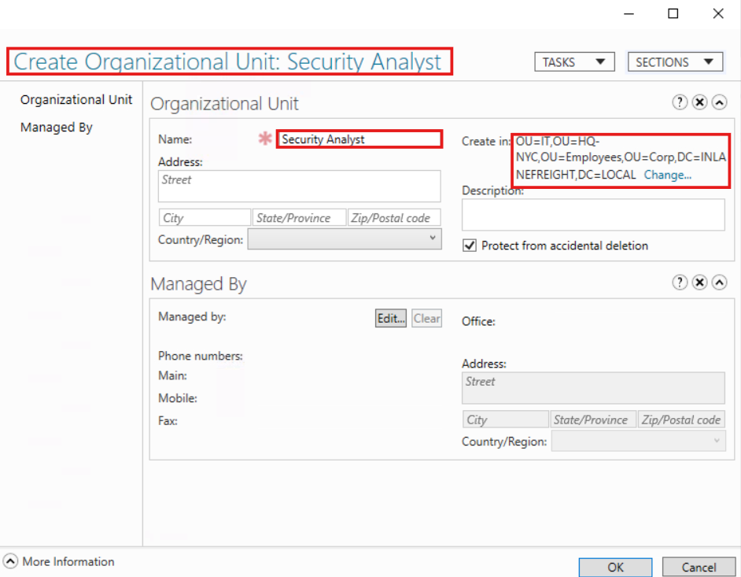
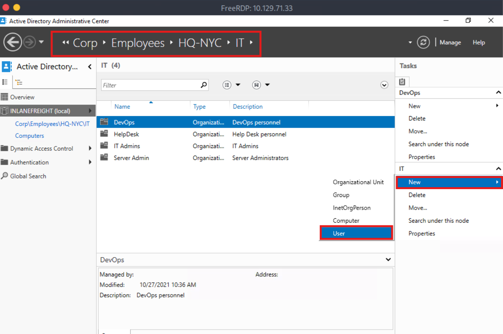
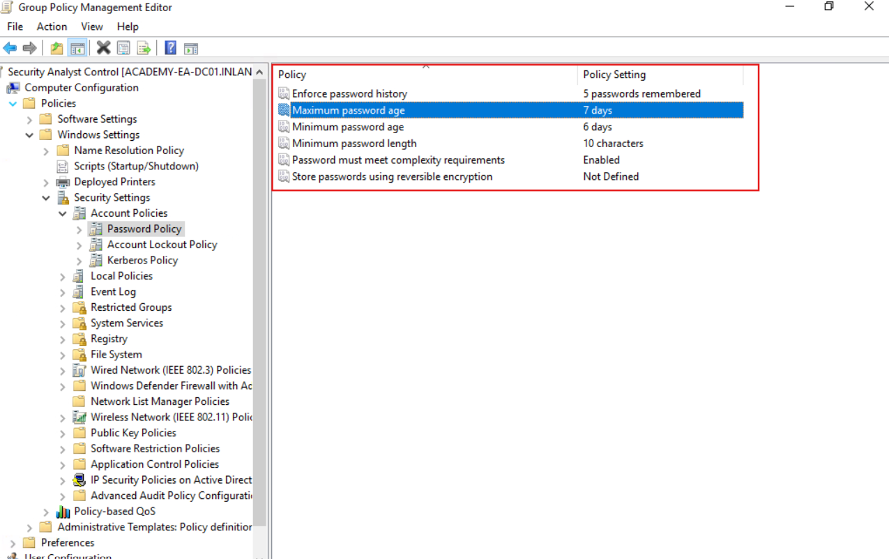

# Foundations of Active Directory

## Project Overview
This lab introduced me to the fundamentals of **Active Directory (AD)** within a simulated Windows enterprise environment. Through hands-on exercises, I explored domain structures, authentication processes, user enumeration, and common security misconfigurations. The project mirrors real-world AD environments used in corporate networks and lays the groundwork for both blue team and red team perspectives.

---

## Objectives
- Understand the structure of Active Directory and how domain components are organized  
- Perform enumeration of users, groups, and domain controllers  
- Explore AD authentication flows and permission hierarchies  
- Identify typical attack surfaces in AD environments

---

## Tools & Technologies
- **Platform**: Hack The Box Academy  
- **Tools Used**: Windows Command Line, PowerShell, ADAC, Group Policy Management Console  
- **Commands Used**: `net`, `whoami`, `nltest`, `dsquery`, `Get-ADUser`, `New-ADUser`, `New-ADGroup`, `Add-ADGroupMember`, etc.  
- **Environment**: Simulated Windows Domain  
- **Skills Practiced**: AD Enumeration, Group & User Management, GPO Implementation

---

## Steps Taken

1. **Initial AD Reconnaissance**
   - Executed commands like `net user /domain`, `nltest /dclist`, and `whoami /all` to gather domain and privilege info  
   - Identified domain users, groups, and the domain controller (DC)

2. **Organizational Unit & Group Creation**
   - Used ADAC to create an `OU` named `Marketing`, and added a group `Marketing-Team` to it  
   - Created and deleted users as part of lifecycle management

3. **Group Membership & GPO Assignment**
   - Added users to the `Marketing-Team` group  
   - Created a Group Policy Object (`Marketing-Policy`) and linked it to the OU to enforce configuration rules

4. **PowerShell Replication**
   - Repeated all tasks from user, group, and OU creation to GPO linking using `ActiveDirectory` PowerShell module  
   - Demonstrated automation-ready workflow for enterprise use

---

## Key Skills & Learnings
- Built hands-on familiarity with AD layout, schema, and administrative interfaces  
- Practiced both GUI and CLI approaches to AD administration  
- Strengthened understanding of domain authentication, GPO behavior, and identity management  
- Gained insight into operational and security implications of AD environments

---

## Screenshots
> All visuals stored in `screenshots/` subfolder

<strong> Key Visuals</strong> (click to expand)

- **OU Creation**
  

  
- **User Management**
  

  
- **Group Policy Applied**
  

---

## Files Included

- [Guided-Lab](/Guided-Lab/AD-Fundamentals.md): Detailed documentation of tasks using ADAC and PowerShell  
- [ad-commands.md](/Guided-Lab/AD-Commands.md): PowerShell Command line reference used throughout the lab  
- [screenshots](screenshots/): Folder containing labeled images from each step

---

## Result
Completed the lab with a strong grasp of Active Directory structure, administration, and security posture. This project developed my skills in managing AD-supported environments, essential for roles in **IT support**, **SOC operations**, and **enterprise security**.

---

## Let’s Connect
I'm seeking entry-level roles in **IT Support**, **SOC Analysis**, or **Security Operations** where I can apply my AD knowledge and hands-on cybersecurity skills.

**Email**: jovaan.jwhitton@gmail.com  
**LinkedIn**: [linkedin.com/in/jovaan-whitton-profile](https://linkedin.com/in/jovaan-whitton-profile)

